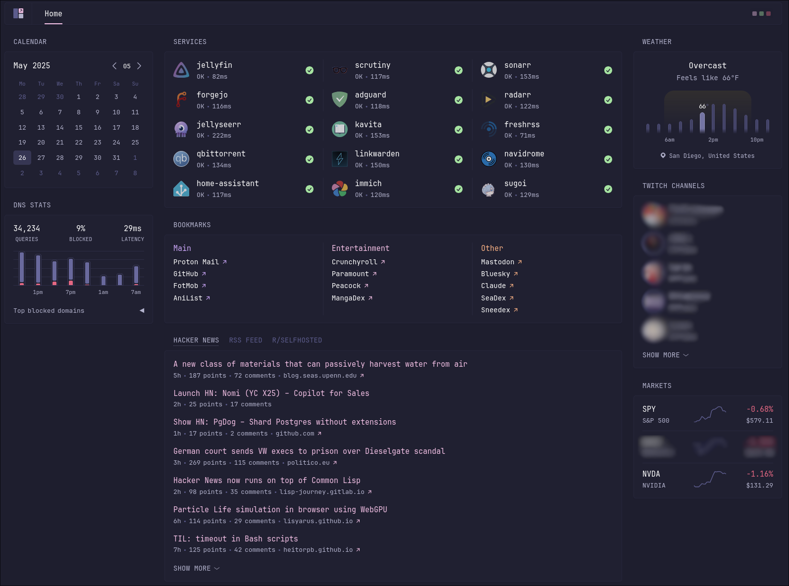

+++
title = "Making My Home Server"
date = 2025-05-27
tags = ["selfhosting", "homelab"]
keywords = ["", ""]
description = "A complete overview of how I built an efficient homelab from scratch, covering hardware selection, power management, and service deployment using NixOS and Docker."
readingTime = true
draft = true
toc = false
+++

In early 2023, I got an itch to see what it would be like to have Linux installed on a bare metal PC, and I had the perfect situation for this as my old PC was just lying around collecting dust after I had to decommission it due to HDD failure. Over the course of the year, this turned more into a home lab as I kept adding more services and hardware into the mix.

## tl;dr: Current Setup

### Main Server - **inari**

[Name Origin](https://mythopedia.com/topics/inari): Sounded cool

- CPU: Intel i5-12400
- RAM: 32GB 3200MHz
- Boot Drive: Acer Predator GM7000 500GB NVMe SSD
- Server Storage: 2x 14TB WD Red Plus HDD
- Case: Jonsbo N2
- Services:
    - [Jellyfin](https://jellyfin.org/)
    - ARR Stack (Sonarr, Radarr)
    - [qBittorrent](https://www.qbittorrent.org/)
    - [Scrutiny](https://github.com/AnalogJ/scrutiny)
    - [Kavita](https://www.kavitareader.com/)

### Mini Server - **chibi**

[Name Origin](https://en.wikipedia.org/wiki/Chibi_(style)): It's a *Mini* PC

- Brand: Beelink Mini PC
- CPU: Intel N100
- RAM: 16GB
- Boot Drive: OEM 512 GB NVMe SSD
- Extra Storage: Samsung 860 Evo 500GB SATA SSD
- Services:
    - [Caddy](https://caddyserver.com/)
    - [AdGuardHome](https://github.com/AdguardTeam/AdGuardHome)
    - [Glance](https://github.com/glanceapp/glance/)
    - [Home Assistant](https://www.home-assistant.io/)
    - [Immich](https://immich.app/)
    - [FreshRSS](https://freshrss.org/index.html)
    - [Forgejo](https://forgejo.org/)
    - [Navidrome](https://www.navidrome.org/)
    - [Linkwarden](https://linkwarden.app/)
    - [Sugoi](https://github.com/frahz/sugoi)

## The Beginning (January 2023)

I dusted off my old PC([yanai](#old-main-server---yanai)) and loaded [Pop!\_OS](https://pop.system76.com/) on it.
At first, I just installed the common desktop apps that one would use and familiarized myself with Pop!\_OS.
It was my first real experience using a Linux desktop. I'll say that most stuff worked as expected out of the box.

But, I soon got bored and stopped using it.

## Turning it into a Home Server (February 2023)

Around February 2023, my friends were getting back into [Valheim](https://www.valheimgame.com/) and at the time,
it was one of my friends hosting the server only when he was online.
This meant that everyone could only play whenever he could leave the server running on PC.
Obviously, this was rather annoying if you wanted to grind the game.

So, I told them that I could try hosting the server on my old PC that was just lying around.
I started looking around how I can host the Valheim server with Linux.
The first method that popped up was the one using the [Steam](https://store.steampowered.com/) dedicated server for Valheim and running the `start_server.sh` script with a couple of flags to use the world files.
This was a rather antiquated way of doing it because I had to keep a terminal window open with the script running (I didn't know about screen/tmux at the time).
I then started looking for ways to do it headless, which led me to this [Valheim Docker container](https://github.com/lloesche/valheim-server-docker).
I had some light experience using Docker, but nothing too in depth.
This was my first real dive into attempting to deploy a service using Docker.
After mucking around, I was able to whip up a `docker-compose.yml` file that I could use.

```yml
version: "3.9"

services:
    valheim:
        image: ghcr.io/lloesche/valheim-server
        container_name: valheim
        cap_add:
            - sys_nice
        volumes:
            - $HOME/Shared/valheim/config:/config
            - $HOME/Shared/valheim/data:/opt/valheim
        ports:
            - "2456-2457:2456-2457/udp"
        env_file:
            - $HOME/Shared/valheim/valheim.env
        restart: unless-stopped
        stop_grace_period: 2m
```

I ran `docker compose up -d` and the service was up and running.
I then had to open some ports on my router so my friends could access the server and it was smooth sailing from there on out.

## Adding More Services (March 2023)

After about a month of hosting the Valheim server, I started looking around to see what else I could self-host.
I stumbled upon [r/selfhosted](https://www.reddit.com/r/selfhosted/) like anyone would.
After looking around, I ended up hosting the default media server stack of [Sonarr](https://sonarr.tv/), [Radarr](https://radarr.video/), [Jellyfin](https://jellyfin.org/), and [qBittorrent](https://www.qbittorrent.org/).

With this media stack, I was able to automate downloads of seasonal Linux ISOs I was following and get any older ones that piqued my interest.

I needed a way to remotely access this new media, so the easy choice was to use [Tailscale](https://tailscale.com/) even if it is not fully self-hosted, unless I use something like [Headscale](https://github.com/juanfont/headscale).

## Using Raspberry Pi Zero W to Wake/Sleep Main Server (August 2023)

Living in a place(San Diego) with some of the highest electricity prices in the US, I can't be running my beefy server all the time.
The server idles at around 40 watts, meaning that running it 24/7 at the current price of \$0.55/kWh would cost around \$16 per month. (40 watts × 24 hours × 30 days × \$0.55/kWh ÷ 1000 = ~\$16/month)

So I needed a way to remotely manage when the server should be on.
I had a Raspberry Pi Zero W lying around and I decided to put it to use, knowing they consume low power.
I quickly created two services, one for the server and one for the RPi.

The program running on the server, named [`sugoi`](https://github.com/frahz/sugoi), would run a lightweight web server that listens for a specific command, that would put the server to sleep.

The program on the RPi, named [`nemui`](https://github.com/frahz/nemui), would be a light web server that either wakes up or sleeps the main server depending on the queried path.
To wake up the server, I enabled [Wake-on-LAN](https://en.wikipedia.org/wiki/Wake-on-LAN) on the server, and from the Pi Zero W I would send the magic packet to the MAC address of the server, waking it up.
For sleeping, the Pi Zero W would run an SSH command(`systemctl suspend`) to put the server to sleep.

After setting up these services, I could wake/sleep the server by accessing the HTTP endpoint running on the Pi Zero W.
This was helpful as the server now only consumes around 1 W while sleeping, and I can turn it on when needed.
However, this meant that **ALL** services were down when the server is asleep, which was sometimes annoying when wanting to access less resource-intensive services (RSS feed, DNS blocker).

## Distributing services to a Lower Power PC (November 2023)

In late 2023, I hearing some buzz around Mini PCs, specifically ones that provide adequate compute and really good power consumption.
The primary one being the ones with the Intel N100 CPU, which comes with 4 cores and idle around 6 W, which is good enough for me to run it 24/7 as it won't cost an arm and leg.
I snapped one up with 16GB RAM and a 500GB SSD for around \$160 USD.

Around this time, I also started getting interested in [Nix](https://nixos.org/), which provides ways to create reproducible builds and environment, all done declaratively.
I loaded it up on this new mini PC to see what all the rage was about.

First, I started with the basics of trying  to install packages declaratively, and so on. Then, branching into running and configuring programs and services using the Nix language.
Once I got familiarized with the basics, I started moving some of the services that I would like to keep online 24/7, like my dashboard, RSS feed, bookmark manager, and DNS server.
I declared these services using OCI Containers, with Docker under the hood, initially as that was the easiest way I found at the time to port them to the Nix way.
Over time, I started moving some of them to native NixOS services, which are more easily configured and follow the Nix way of doing things.

## Switching to NixOS (January 2024)

Later down the line I decided that I enjoyed declaring my services using Nix instead of running them on a regular distro, like I was doing currently on my main server.
So, I took this opportunity to build a new PC that takes less space, supports more hard drives, and use more modern hardware with support for newer and more efficient hardware video decoding.

For the case I went with the [Jonsbo N2](https://www.jonsbo.com/en/products/N2White.html) case, due to it supporting up to 5 drives with an easy way to mount them.
I went with an Intel i5-12400 for the CPU and 32GB RAM. This gives me some headroom to run a decent amount of services, and possibly down the line use it as a build server.
I moved the HDDs to this new PC and got to work.

For the initial move, I just ported the docker containers as OCI containers for simplicity's sake until I got more familiar with the NixOS ecosystem.

## Status Update (August 2024)

I started getting more accustomed to NixOS, now deploying native services and using some of the secrets management flake utilities which allow me to keep everything in a single repository.
Also moving services that started as OCI containers to native NixOS services (jellyfin, sonarr, radarr, etc.).
Added a couple of new services like [AdGuardHome](https://github.com/AdguardTeam/AdGuardHome) for DNS blocking and [Caddy](https://caddyserver.com/) instead of Nginx Proxy Manager for reverse proxying my services.

## Current Status (June 2025)

Over the last year, I've been refining my homelab configuration and adding new services that reduce my reliance on Big Tech (Google, Microsoft, etc.).
Some of these new services include [Immich](https://immich.app/), [Home Assistant](https://www.home-assistant.io/), [Forgejo](https://forgejo.org/), and [Navidrome](https://www.navidrome.org/).

To unify access to all these services I wanted to add a dashboard, I started with [Dashy](https://dashy.to/) but I didn't like the configuration format and how it looked by default.
I moved to [Homarr](https://homarr.dev/) sometime in 2023 because it was one of the cleaner dashboards at the time with some really nice integrations. I kept using it when I moved to NixOS, but got tired of the dashboard being configured through the UI and it getting messed up after updating. When [Glance](https://github.com/glanceapp/glance) was first teased on r/selfhosted, I knew I had found my perfect dashboard solution. It has just the right amount of simplicity, looks, and customizability (while also being configured using a file!).

Here is how I have organized my dashboard:



In the future, I plan to add a proper backup solution using Restic to upload to Backblaze.

## Out of Commission PCs

### Old Main Server - **yanai**

[Name Origin](https://en.wikipedia.org/wiki/Yanai,_Yamaguchi): Sounded cool

- CPU: Intel i7-7700K
- RAM: 16GB 3200MHz
- Boot Drive: Samsung 960 Evo 256GB NVME SSD
- Server Storage: 2x 14TB WD Red Plus HDD


### Digital Ocean VPS - **kumo**

[Name Origin](https://www.nihongomaster.com/japanese/dictionary/word/16254/kumo-%E9%9B%B2-%E3%81%8F%E3%82%82): It's a server on the cloud

- $6/mo Digital Ocean Basic Droplet

